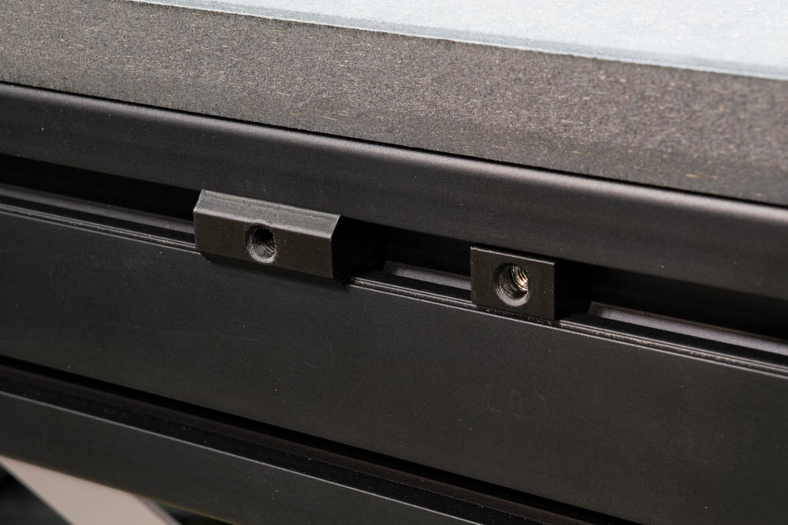

# Benchdogs Ultra MFT Workstation T-Nuts

Benchdogs.co.uk Ultimate Ultra MFT Workstation accessory T-nuts.  The basic
variant allows for flat-mounting accessories while the aligning variant can be
used with compatible accessories to prevent twisting while only using a single
nut.  Requires M5 hex nuts and bolts.

Compatible accessories for aligning nut:

* Parametric bin:
* Festool hose holder: https://www.printables.com/model/806346-festool-d27-d36-suction-hose-holder
* Festool tray: https://www.printables.com/model/1018342-festool-tray
* Festool drill holder: https://www.printables.com/model/1010138-festool-drill-holder
